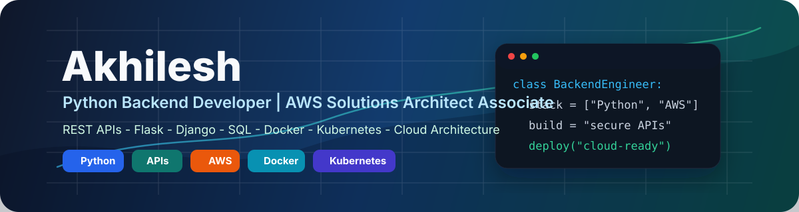

  

<h1 align="center">Akhilesh</h1>

<h3 align="center">AI/ML + Backend Engineer | RAG Systems | Python APIs</h3>

  I build practical AI-powered backend systems: retrieval workflows, document intelligence tools, forecasting pipelines, and API-driven applications.

  
  
  

## Focus

I am focused on backend engineering for AI/ML products, especially systems that combine clean Python APIs with retrieval, structured data, and real user workflows.

- Building RAG-style knowledge workflows for question answering and document search.
- Developing Python backend services around AI/ML features, data processing, and analytics.
- Working with OCR, document intelligence, chatbots, forecasting, and financial data workflows.
- Applying AWS architecture fundamentals to design systems with reliability and deployment in mind.

## Core Stack

| Area | Tools and Concepts |
| --- | --- |
| Backend | Python, FastAPI, Flask, Django, REST APIs |
| AI/ML | Pandas, scikit-learn, Jupyter, forecasting, classification, OCR workflows |
| RAG and LLM Apps | Knowledge-base chatbots, retrieval pipelines, embeddings, vector search concepts, prompt design |
| Databases | SQL, PostgreSQL, data modeling |
| Delivery | Git, GitHub, Docker, Streamlit, AWS architecture |

## Featured Work

| Project | Why It Matters | Stack |
| --- | --- | --- |
| [InvoiceAI](https://github.com/akhil16-svg/InvoiceAI) | AI invoice-processing platform with OCR, fraud checks, and financial analytics. Shows document intelligence, backend data flow, and deployment awareness. | Python, Streamlit, PostgreSQL, Docker |
| [Medical Assistant Chatbot](https://github.com/akhil16-svg/Medical-Assistant-Chatbot) | Knowledge-base chatbot prototype for health-related Q&A workflows. Relevant to RAG-style assistant design and retrieval-backed answers. | Python, chatbot workflows |
| [Forecasting Walmart Sales](https://github.com/akhil16-svg/Forecasting-Walmart-Sales) | End-to-end ML notebook project for sales forecasting using preprocessing, feature engineering, and regression models. | Python, Jupyter, pandas, regression |
| [Real Estate Platform](https://github.com/akhil16-svg/Real-Estate-Platform) | Full-stack application showing product thinking, backend/frontend integration, and structured web workflows. | JavaScript, web app |
| [Portfolio Website](https://github.com/akhil16-svg/akhilesh.portfolio.github.io) | React portfolio presenting projects, experience, and AI/backend positioning in one place. | React, Tailwind, Vite |

## Credentials

- AWS Certified Solutions Architect - Associate.
- Completed IBM Back-End Development coursework through Coursera.
- M.S. Computer Science, California State University, East Bay.

## What I Am Looking For

I am looking for software engineering roles where I can work on AI/ML applications, RAG systems, backend APIs, data-heavy products, and cloud-aware application architecture.

## GitHub Activity

  

  
  

